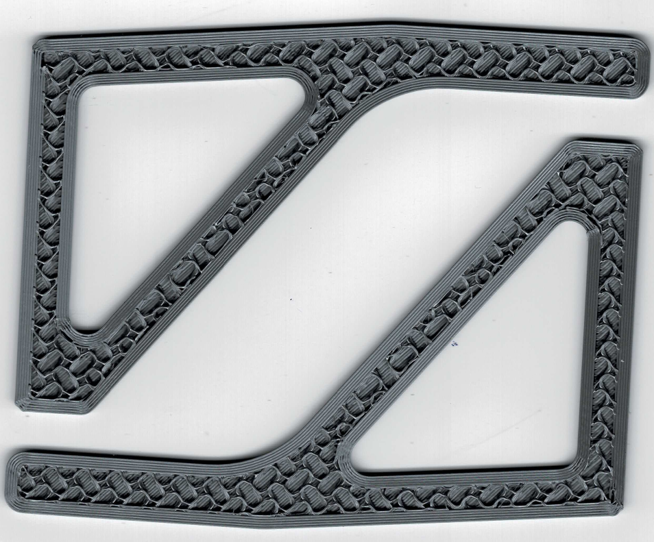
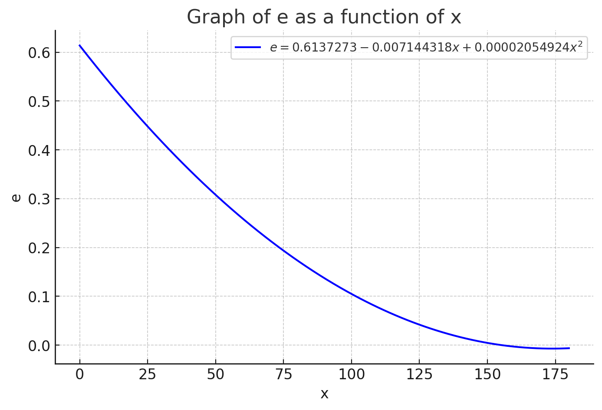
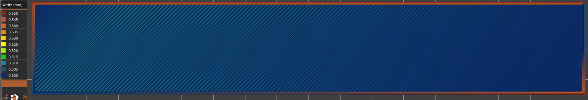

# Wack2 extrusion compensation script

By @murk:

My first wack compensation script didn't really achieve what I wanted
(consistent extrusion width), so I went back to the drawing board.
Instead of playing around with relative extrusion increases,
I've decided to go back to the very first test I've made ([#2997 (comment)](https://github.com/prusa3d/Prusa-Firmware-Buddy/issues/2997#issuecomment-2525070078))
where I measured the actual length of the filament in different positions,
with pretty decent results I could say.

As visible in the following image, apart on the curves, the extrusions are pretty
consistent all the way around, which was definitely not the case before.

## What it does

Because the shape of the tube changes, the maximum "pushed" length of the tube
changes as well. In order to compensate for that smoothly,
I've converted the data gathered before into a formula.

The graph shows how far the tip of the filament in the nozzle moves without any
extrusion, only X movement. Meaning, when moving to the left, the absolute
position of the extruder should be adjusted dynamically.
Theoretically, when moving to the right, you could have extrusions
where the extruder shouldn't actually move to extrude the correct amount.

In gcode preview (if you disable travel move adjustments in the script),
you can very nicely see what this means with larger parts in the line width view:

## Caveats

* The intention of this script is to just equalize extrusion width because of
bowden tube travel, not so much to fully fix the original issue

* For accurate compensation, this script would require short extrusion lines.
The above image with the gradient of extrusion widths shows a consistent
extrusion when traveling basically the full width, which should not be the case.
For a proper resolution of this specific issue, the E axis should be bound to
the X axis using the above formula in firmware.

* This script might not fully resolve the inconsistent extrusion after travel
issues. I'm still planning to replace the hotend PTFE tube on my printers with
the official one, which may be the actual culprit.
You can even see that issue in the very first image of that comment.

* The script rudimentarily compensates G2 and G3 moves as well, but based only on
the final position. The very first photo shows small curves looking the worst.

* The script by default deletes line width information and changes travel move
information in the gcode. Avoid using gcode viewer for things beyond script
modifications.

## Script

The current script, as it stands, is fairly simple and could be implemented in
firmware without too much math. For best theoretical accuracy, a recalculation
should be done as the move happens, but if there's no compute power for
a quadratic function to run all the time, it could probably be simplified
and made to use a lookup table in some way.

Several things in the script were disabled as a result of my own testing,
but you can reenable them if you feel adventurous:

* Settling: used to slowly add or remove extrusion length when changing
  direction (I tested with 0.2 mm range). I ended up having slightly better
  results without it, so I set it to 0.
* Freeze settling on travel moves: Same as above, didn't seem to have decent
  effect
* Force full flow: Not tested at this time, would change flow to 100%
  instead of default 95% on the mini, so it doesn't have to be changed in
  the slicer.
* Adjustment hard limit factor: Essentially deprecated, was used before travel
  moves had extrusions applied by default. That has caused some issues with
  very short extrusions having extreme flow values
* Verbose: inserts information about absolute and relative extruder adjustment,
  settling value, and change in x

Download script here: [download repo master branch as zip](https://github.com/nvtkaszpir/bowden-wack2-compensation/archive/refs/heads/master.zip)

Contains:

* `bowden_wack2_compensation.py`
* `test1nocrossing.gcode` - gcode from @Prusa-Support to test the issue
  [#2997 [BUG] Delayed extrusion after travel when using 0.6 mm nozzle...](https://github.com/prusa3d/Prusa-Firmware-Buddy/issues/2997#issuecomment-1454763541)
* `test1nocrossing_wack2.gcode` - (above gcode adjusted with wack2)

## Important

Despite this improving the quality of my standard PETG prints on
my minis 2 and 3, this seems to cause overextrusion with this test gcode with
PLA on printer 1. yedvilun's script improves the test gcode for me,
but doesn't resolve the inconsistent extrusion width.

Testing is still required. While I will likely start using it in production,
it might not work as well for you.

**Usage:**

* Convert bgcode to gcode using the gcode viewer or disable binary gcode in
  PrusaSlicer
* Install python
* Open commandline (win+r and type "cmd")
* Find python executable and shift+right click it and "copy as path"
* Paste the path into commandline with right click
* Do the same for the .py file location and the gcode file location in that
  order, separated by spaces, and then run it.

If you wish to test wack2 but don't want to deal with python and commandline,
feel free to post your gcode as a comment and I'll process it.
Alternatively, if you're in the Official Prusa discord,
you can just ping me there (username murk).
